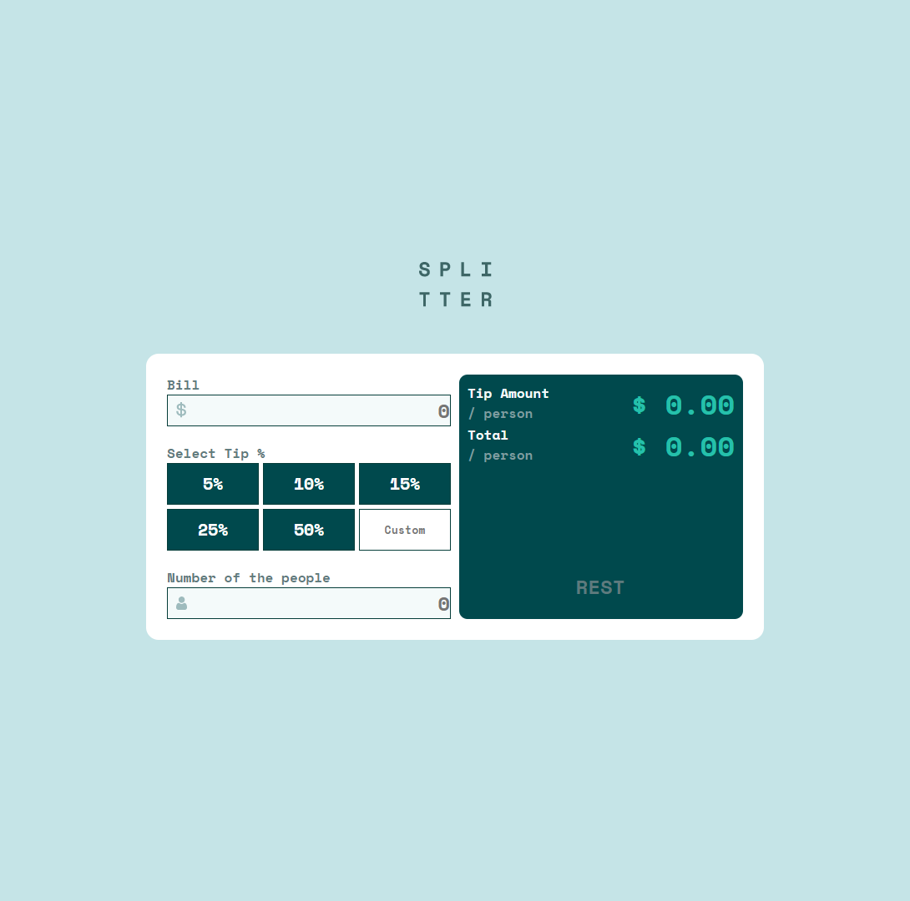

# Frontend Mentor - Tip calculator app solution

## Table of contents

  - [The challenge](#the-challenge)
  - [Screenshot](#screenshot)
  - [Links](#links)
  - [What I learned](#what-i-learned)
  - [Continued development](#continued-development)

- [Author](#author)

### The challenge

Users should be able to:

- View the optimal layout for the app depending on their device's screen size
- See hover states for all interactive elements on the page
- Calculate the correct tip and total cost of the bill per person

### Screenshot

### Links

- Live Site URL: [Add live site URL here](https://your-live-site-url.com)

### Built with

- Semantic HTML5 markup
- CSS custom properties
- Flexbox
- CSS Grid
- Mobile-first workflow
-basic javascript 

### What I learned

-javascript basic function
-javascript logics
-foreach statement

### Continued development

-css grid
-css flex
-Mobile-first workflow
-javascipt fandamentals

## Author

- Frontend Mentor - [@haile212]
(https://www.frontendmentor.io/profile/haile212)

